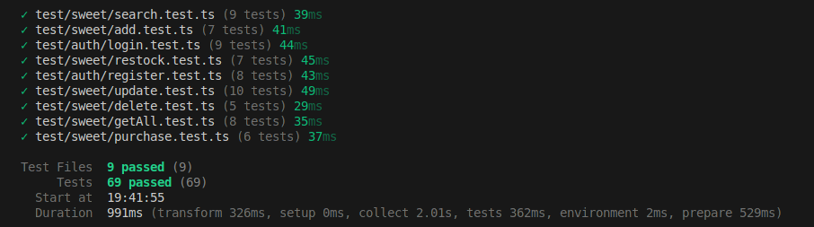

# 🍭 Sweet Shop Management System 

## 📖 Introduction
The **Sweet Shop Management System** is a full-stack application built as part of the **Incubyte recruitment assignment**.  It is developed with **React, Node.js, TypeScript, and Prisma**, following the principles of **Test-Driven Development (TDD)** to ensure reliability and maintainability.

## 🔬 Development Approach
This project was created using the **Red ➡ Green ➡ Refactor** methodology of TDD:

- 🟥 **Red Phase**: Write failing test cases describing the expected behavior.  
- 🟩 **Green Phase**: Implement the simplest working code to make those tests pass.  
- 🔄 **Refactor Phase**: Improve the design, remove duplication, and optimize code while ensuring tests remain green.  

## 🧾 Commit History
Every step of the implementation is reflected in the commit history.  
Meaningful **Conventional Commits** were used, making it easy to trace progress through the TDD cycle.  
Example commit flow:  
- `test: add tests for sweet purchase endpoint`  
- `feat: implement sweet purchase service and controller`  
- `refactor: clean up purchase service logic`  

---

## ✨ Features

- 🔐 **User Authentication**  
  - Secure registration and login with JWT-based authentication  
  - Role-based access (Admin / User)  

- 🛠️ **Admin Dashboard**  
  - Add, update, delete, and restock sweets  
  - Manage inventory through a protected panel  

- 🛒 **Customer Features**  
  - Browse all available sweets  
  - Purchase sweets with automatic stock update  
  - Search sweets by name and filter results  

- 🎨 **Frontend Experience**  
  - Responsive UI built with Tailwind CSS   
  - Context-based state management for authentication and sweets  

- ⚙️ **Backend API**  
  - Express.js RESTful API with modular routes and services  
  - Prisma ORM for database operations  
  - Zod for request validation  
  - Centralized error handling middleware  

- ✅ **Testing**  
  - Comprehensive testing with **Vitest**  
  - API integration testing using **Supertest**  
  - Fully TDD-driven (Red → Green → Refactor) implementation  

---

## 🏗️ Tech Stack

### 🎨 Frontend
- React (with Vite + TypeScript)  
- React Router DOM for navigation  
- Tailwind CSS for modern, responsive styling  
- Context API for authentication & sweets state management  
- Axios for API requests  

### ⚙️ Backend
- Node.js with Express.js  
- TypeScript for type safety  
- Prisma ORM for database operations (PostgreSQL)  
- JWT for authentication & authorization  
- Zod for schema validation  
- dotenv for environment configuration  
- CORS middleware for cross-origin support  

### 🧪 Testing
- Vitest for unit and integration testing  
- Supertest for HTTP request testing  

---

## 📂 Project Structure

```
root/
├── backend/
│   ├── src/
│   │   ├── controllers/        # Request handlers (auth, sweets, etc.)
│   │   ├── middlewares/        # Auth & error handling
│   │   ├── routes/             # API route definitions
│   │   ├── schema/             # Zod validation schemas
│   │   ├── services/           # Business logic (auth, sweets)
│   │   ├── utils/              # Prisma client, helpers
│   │   └── server.ts           # Express app entry point
│   ├── tests/                  # Vitest + Supertest test suites
│   │   ├── auth/               # Authentication tests
│   │   └── sweets/             # Sweet management tests
│   ├── prisma/                 # Prisma schema & migrations
│   ├── package.json            # Backend dependencies
│   └── tsconfig.json           # TypeScript config
│
├── frontend/
│   ├── public/                 # Static assets (images, icons)
│   ├── src/
│   │   ├── assets/             # Project assets
│   │   ├── components/         # UI components (Navbar, SweetCard, etc.)
│   │   ├── context/            # React context providers (Auth, Sweets)
│   │   ├── pages/              # Page-level components (Login, Dashboard, AdminPanel)
│   │   ├── validation/         # Frontend validation schemas
│   │   ├── utils/              # Helpers (e.g., JWT parser)
│   │   ├── api.ts              # API client (Axios instance)
│   │   ├── App.tsx             # Main app component
│   │   ├── main.tsx            # React DOM entry point
│   │   └── index.css           # Global styles
│   ├── package.json            # Frontend dependencies
│   └── vite.config.ts          # Vite configuration
│
├── ui/                         # Screenshots, mockups, and UI designs
└── README.md                   # Project documentation
```
---

## ⚡ Getting Started

Follow the steps below to set up the project locally.

📥 Clone the repository
```bash
git clone https://github.com/Dev050x/Sweet_Shop_Management_System.git
cd Sweet_Shop_Management_System
```


### 🔧 Backend Setup

1. Navigate to the backend folder:
   ```bash
   cd backend
   ```

2. Install dependencies:
   ```bash
   npm install
   ```

3. Configure environment variables: Create a `.env` file in `backend/` with the following:
   ```env
   DATABASE_URL=
   JWT_SECRET=
   ```

4. Run database migrations:
   ```bash
   npx prisma migrate dev
   ```

5. Start the backend server:
   ```bash
   npm run build
   npm run dev       or   npm start(for production)
   ```

By default, the API runs at: **http://localhost:3000**


### 🎨 Frontend Setup

1. Navigate to the frontend folder:
   ```bash
   cd frontend
   ```

2. Install dependencies:
   ```bash
   npm install
   ```

3. Start the frontend:
   ```bash
   npm run dev
   ```

The frontend will run at: **http://localhost:5173**


### 🧪 Running Tests

To run all backend tests (Vitest + Supertest):

```bash
cd backend
npm run test
```
---

## 📡 API Endpoints

Base URL: `http://localhost:3000/api`


### 🔐 Authentication
| Method | Endpoint              | Description          | Auth Required |
|--------|-----------------------|----------------------|---------------|
| POST   | `/auth/register`      | Register a new user  | ❌            |
| POST   | `/auth/login`         | Login and get token  | ❌            |


### 🍬 Sweet Management
| Method | Endpoint                               | Description                | Auth Required | Role   |
|--------|----------------------------------------|----------------------------|---------------|--------|
| POST   | `/sweets`                              | Add a new sweet            | ✅            | Admin  |
| GET    | `/sweets`                              | Get all sweets             | ✅            | Public |
| GET    | `/sweets/search?name={name}`           | Search sweets by name      | ✅            | Public |
| GET    | `/sweets/search?category={category}`   | Filter sweets by category  | ✅            | Public |
| GET    | `/sweets/search?minPrice={value}`      | Filter by minimum price    | ✅            | Public |
| GET    | `/sweets/search?maxPrice={value}`      | Filter by maximum price    | ✅            | Public |
| GET    | `/sweets/search?available={boolean}`   | Filter by availability     | ✅            | Public |
| PUT    | `/sweets/:id`                          | Update sweet details       | ✅            | Admin  |
| DELETE | `/sweets/:id`                          | Delete a sweet             | ✅            | Admin  |
| POST   | `/sweets/:id/purchase`                 | Purchase a sweet           | ✅            | User   |
| POST   | `/sweets/:id/restock`                  | Restock a sweet            | ✅            | Admin  |


### 🛠️ Error Handling
All error responses follow this format:
```json
{
  "success": false,
  "message": "Error message here"
}
```
---
## 🤖 AI Usage

This project leveraged multiple AI tools to speed up development, testing, and documentation.  
Each AI assistant was used for a specific purpose:

- 🛠️ **API Development** → *GPT-5*  
  Used to design backend routes, services, and validation schemas while following TDD best practices.  

- 🧪 **Testing Guidance** → *Claude*  
  Assisted in writing unit tests with **Vitest + Supertest**, ensuring full coverage for auth and sweet modules.  

- 🎨 **Styling & UI** → *v0*  
  Helped refine **Tailwind CSS** components, and overall frontend styling.  

- 📖 **Documentation** → *GPT-5*  
  Generated project documentation, including **README.md**, API endpoints, and setup instructions.  

---

## 🚀 CI/CD Pipeline

This project uses **GitHub Actions** for continuous integration and testing.


### What it does
- ✅ Runs on every **push** and **pull request** to `main`
- 🛠 Installs backend dependencies (`npm install`, `prisma generate`)
- 🔎 Runs automated tests with **Vitest + Supertest**
- 🧹 Ensures code quality before merging to `main`

You can view the latest pipeline runs here:  
👉 [GitHub Actions – CI/CD Pipeline](https://github.com/Dev050x/Sweet_Shop_Management_System/actions/workflows/test.yml)

---

## 🧪 Testing Report

The project follows **Test-Driven Development (TDD)** using **Vitest + Supertest**.  

### 📊 Test Results


---
## 👨‍💻 Author

**Div Patel**  
- 🌐 GitHub: [Dev050x](https://github.com/Divpatel4081)  
- 💼 LinkedIn: [Div Patel](https://www.linkedin.com/in/div-patel-0700a2214/)  
- 📧 Email: divpatel4081@gmail.com  

---

This project is built as part of an interview assignment.


